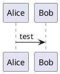

# CI/CD Badge


[](https://app.codecov.io/gh/LobotomyTerror/OOP-dfishbein)

# Course Description


| __Course__          | CSCI 375 - OOP Design                             | 
| ------------------- | ------------------------------------------------- |
| __Section__         | 1                                                 | 
| __Semester__        | Spring 2024                                       |
| __Student__         | Daniel Fishbein                                   | 
| __Mav Username__    | dfishbein                                         | 
| __GitHub Username__ | LobotomyTerror                                    |
| __Repository__      | https://github.com/LobotomyTerror/OOP-dfishbein   |


# Assignments


## Assignment 4


| __Assignment Details__ | __Info__                                       |
|------------------------|------------------------------------------------|
| __Name__               | A4 - Mocking and Hypothesis                    |
| __Description__        | Using Object-Oriented Design to solve Kattis problem [Title Cost](https://open.kattis.com/problems/titlecost) and using unittest library along with mocking and hypothesis |
| __Due__                | 04/19/2024                                     |
| __Difficulty__         | 1.7 as of 3/04/2024                            |
| __Status__             | Completed                                      |
| __Location__           | https://github.com/LobotomyTerror/OOP-dfishbein/tree/main/assignments/A4-Mocking_Hypothesis/titlecost                     |
| __Self Grade__         | 100/100                                        |
| __Notes__ | Was able to solve the problem relatively quickly and didn't really have any trouble solving the kattis problem or setting up the project folder |


## Assignment 3


| __Assignment Details__ | __Info__                                       |
|------------------------|------------------------------------------------|
| __Name__               | A3-Unittesting Morse Code Palindrome           |
| __Description__        | Using Object-Oriented Design to solve Kattis problem [Morse Code Palindrome](https://open.kattis.com/problems/morsecodepalindromes) and using unittest library and hypothesis |
| __Due__                | 03/07/2024                                     |
| __Difficulty__         | 3.0 as of 3/04/2024                            |
| __Status__             | Completed                                      |
| __Location__           | https://github.com/LobotomyTerror/OOP-dfishbein/tree/main/assignments/A3-unittesting/morsecodepalindromes                      |
| __Self Grade__         | 100/100                                        |
| __Notes__ | Created a test file to initially to solve the Kattis problem but had a little trouble creating the classes for it because I couldn't figure out how to set it up. Once done was able to get it completed. Still need to work on understanding unittesting as well. |

## Assignment 2


| __Assignment Details__ | __Info__                                       |
|------------------------|------------------------------------------------|
| __Name__               | A2-OOD Convex Polygon Area                     |
| __Description__        | Using Object-Oriented Design to solve Kattis problem [Convex Polygon Area](https://open.kattis.com/problems/convexpolygonarea) |
| __Due__                | 02/28/2024                                     |
| __Difficulty__         | 2.0 as of 2/20/2024                            |
| __Status__             | Completed                                      |
| __Location__           | https://github.com/LobotomyTerror/OOP-dfishbein/tree/main/assignments/A2-OOD/convexpolygonarea                           |
| __Self Grade__         | 100/100                                        |
| __Notes__ | Had a little trouble setting up at first and getting everything setup but after a little bit I was able to get the modules created. I also learned a lot of different aspects of OOD |

## Assignment 1


| __Assignment Details__ | __Info__                                       |
|------------------------|------------------------------------------------|
| __Name__               | Python Quizzes                                  |
| __Description__        | Solving basic syntax and other specifics about python with doing short quizzes |
| __Due__                | 02/13/2024                                     |
| __Difficulty__         | N/A                                            |
| __Status__             | Completed                                      |
| __Location__           | https://github.com/LobotomyTerror/OOP-dfishbein/tree/main/assignments/A1-review/screenshots                           |
| __Self Grade__         | 100/100                                        |
| __Notes__ | Noticed a lot of areas that I could improve with Python but I also surprised myself with some of the other areas I did well on               |

## Assignment #0


| __Assignment Details__ | __Info__                                       |
|------------------------|------------------------------------------------|
| __Name__               | Sort Two Numbers                               |
| __Description__        | Solving a simple Kattis problem [sorttwonumber](https://open.kattis.com/problems/sorttwonumbers) and getting Environment setup    |
| __Due__                | 02/06/2024                                     |
| __Difficulty__         | 1.4 as of 01/29/2024                           |
| __Status__             | Completed                                      |
| __Location__           | https://github.com/LobotomyTerror/OOP-dfishbein/tree/main/assignments/assingment_one/sorttwonumbers                           |
| __Self Grade__         | 100/100                                        |
| __Notes__ | Had a little trouble figuring out the kattis cli but was able to figure it out. Everything is working as of now and submitted              |


## PlantUML CLI project

Simply project that I have added to my list of stuff. All I wanted to be able to do was run the plantuml program through the command line which makes it a lot faster when wanting to output the uml diagram. So far I have gotten a little head way done with this project. I have gotten it to be downloaded into the container and set an environment variable so that it can be used as a variable instead of using the entire absolute path to run the jar file. Next I need to get it aliased so that it can simply be a variable typed in that runs the jar script in the background and outputs a uml file from the acceptable files that work with the jar command.

So far this is what I have:

```
java -jar $PLANT test.txt
```

This works for the moment but I want to continue to improve this by adding an alias to this environment variable, so it would look like this:

```
plantuml test.txt
```

Other information about how this works is pretty straight forward. It requires specific file types that it can convert to a png file that displays the actual uml diagram.

I created a .txt file for this and put this in the file itself:


Once that is created you can run the above command and it will output:


